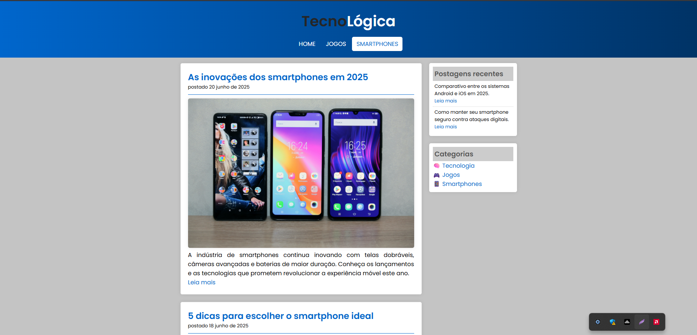
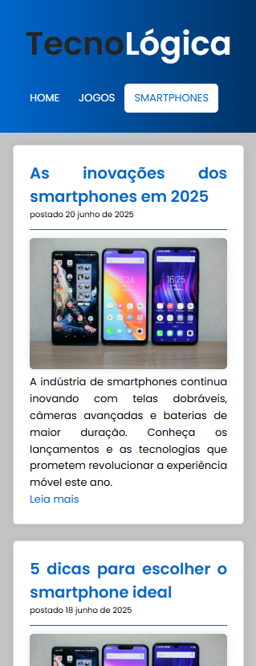

# 🌐 TecnoLógica

**Projeto Front-End Simples em HTML e CSS com foco em tecnologia, jogos e smartphones.**

Este projeto foi desenvolvido com fins acadêmicos e tem como objetivo aplicar boas práticas de HTML semântico, estilização com CSS moderno e princípios de acessibilidade.

---

## 📄 Descrição

O site **TecnoLógica** é um portal informativo fictício sobre o mundo da tecnologia. Ele é dividido em três seções principais:

- **Home:** Destaques sobre tendências e inovações tecnológicas.
- **Jogos:** Notícias e artigos sobre o universo gamer e inovações nos games.
- **Smartphones:** Conteúdos sobre os lançamentos, dicas e comparativos de celulares.

---

## 🎯 Funcionalidades

- Layout responsivo com Flexbox.
- Estrutura HTML semântica com `header`, `main`, `nav`, `section`, `article`, `aside` e `footer`.
- Links de navegação com indicação da página ativa.
- Imagens com `alt` descritivo.
- Acessibilidade com:
  - Skip link ("Pular para o conteúdo")
  - Fonte legível (Poppins do Google Fonts)
  - Boa hierarquia de títulos
  - `aria-label` em links e navegação

---

## 🧪 Tecnologias Utilizadas

- HTML5 (semântico)
- CSS3 com variáveis, Flexbox e media queries
- Google Fonts (`Poppins`)
- JavaScript básico para destacar o menu ativo

---

## 📸 Capturas de Tela

### 💻 Versão Desktop

### 💻 Versão Tablet

### 📱 Versão Mobile

